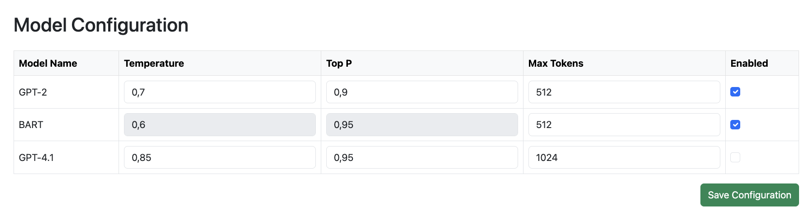

# **TextNexus**  
_A Multi-Model AI System for Advanced Text Processing and Transformation_


## **Overview**  
TextNexus is an open-source, locally deployable text generation and transformation system designed for privacy-first, offline-capable operation. It supports various types of text manipulation – such as paraphrasing, summarization, masked word prediction, and chat-style dialogue – using a modular architecture that integrates both local AI models and optional external LLM APIs.

TextNexus is built with a **multi-access architecture**, ensuring usability **both through a graphical user interface (GUI) and via a robust API**, making it a **versatile solution** for developers, researchers, and enterprise applications.

The system is optimized for deployment on user machines or internal organizational servers, ensuring that sensitive data remains under full local control.

---

## **Key Features**  
✅ **Local + API-Based AI Integration** – Combine offline models (e.g., GPT-2, BERT, DeepSeek) with optional external LLM APIs for flexible, private text processing.  
✅ **Memory-Persistent Processing** – Features a **database-backed memory system** to enhance contextual awareness.  
✅ **Model-Orchestrated Text Refinement** – Enables **dynamic linking between AI models** to generate optimized outputs.  
✅ **API & UI Accessibility** – Designed for both **interactive use via a user interface** and **programmatic access through an API**.  
✅ **Scalable & Extensible** – Modular architecture allows easy **expansion with additional AI models and processing pipelines**.  
✅ **Model Quality Evaluation Dashboard** – Includes visual analytics to compare model outputs using metrics like coherence, lexical diversity, and repetition rate.

---

## **System Architecture**  
TextNexus is built as a **multi-component system** that integrates **various NLP models and external AI services**, facilitating **adaptive text processing** through a combination of:  

- **Pretrained AI Models** (GPT, BART, BERT, DeepSeek, etc.)  
- **Paid Large Language Model APIs** for enhanced capabilities  
- **A database-backed memory system** for persistent context retention  
- **Dynamic model linking** to refine and optimize text transformation  
- **REST API & UI interfaces** for broad accessibility and ease of use  

This **interoperable framework** allows TextNexus to be employed in diverse **text-based AI applications**, from **automated content generation and data augmentation to advanced linguistic analysis**.

TextNexus is structured for future extensibility and built with components like SQLite, Flask, and HuggingFace Transformers to support both experimentation and production use.

---

## **Use Cases**  
🔹 **Paraphrasing & Summarization** – Intelligent rewriting and condensation of text.  
🔹 **Masked Word Prediction** – Context-aware word substitution and text completion.  
🔹 **Model Comparison & Optimization** – Visualize and assess model behavior across multiple quality metrics.  
🔹 **Automated Text Processing Pipelines** – Scalable AI-powered linguistic workflows.  
🔹 **API-Driven Text Augmentation** – Seamless integration into external applications.  

---

## **Installation**  
To set up TextNexus, clone the repository and install the dependencies:

```bash
git clone https://github.com/jorissdev/TextNexus.git
cd TextNexus
pip install -r requirements.txt
```

---
## 🖼️ User Interface Previews

Visual overview of the main UI modules in TextNexus:

### 🔹 Text Generation View


### 🔹 Chatbot Interface


### 🔹 Available models


### 🔹 Model Configuration Panel


### 🔹 Role-Based Access Control View


### 🔹 Usage Statistics Dashboard


### 🔹 Settings Panel


### 🔹 API Documentation View


### 🔹 Model Analysis Dashboard

